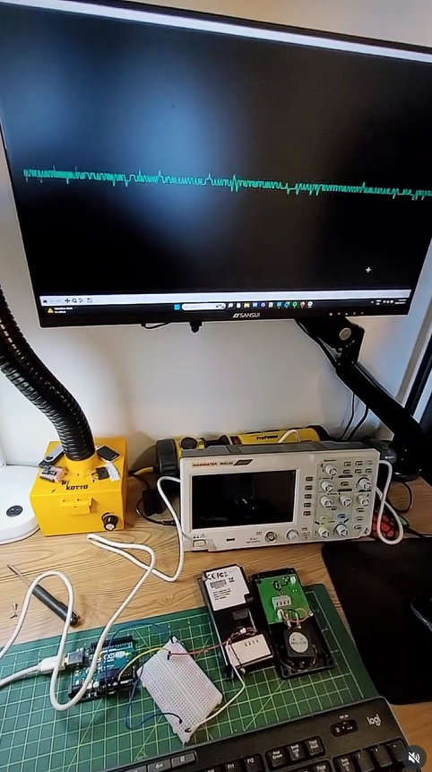
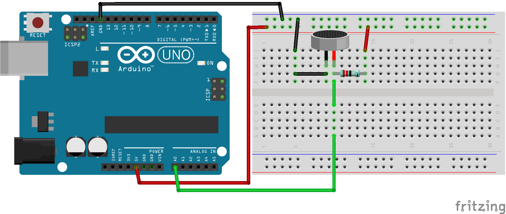
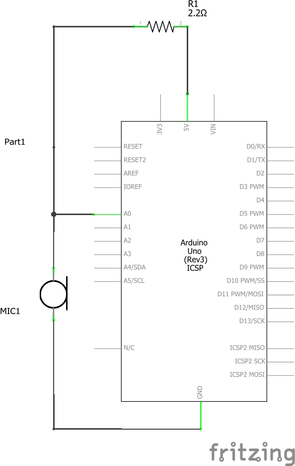

# ArduinoMicTest
A simple hardware and software toolkit for real-time microphone testing and visualization. Capture raw analog data from an electret condenser microphone using an Arduino, then visualize the waveform on your PC.

<p align="center">
  
  <br/>
  <a href="https://www.instagram.com/p/DKnwIhHPPUP/" target="_blank">See it in action</a>
</p>
## Repository Contents

- `schematic.png` & `breadboard.png` – wiring diagrams for hardware setup  
- `MicTest.ino` – Arduino sketch for high-speed ADC sampling  
- `mictest.py` – waveform visualizer Python script  
- `LICENSE` – project license  

## Hardware Requirements

- Arduino (Uno, Nano, etc.)  
- Electret condenser microphone capsule (e.g. CMEJ-0605-36-L030)  
- 2.2 kΩ resistor (or 4.7 kΩ for increased sensitivity)  
- Breadboard & jumper wires  
- USB cable to connect Arduino to PC  

## Wiring

Refer to the included wiring diagrams:



**Power & Bias:** Connect Arduino 5 V → 2.2 kΩ resistor → mic **+** pin; mic **−** pin → GND.  
**Signal:** Tap the junction of the resistor and mic **+** into the Arduino’s A0 analog input.  
*Adjust sensitivity:* swap the 2.2 kΩ for 4.7 kΩ to boost mic current (louder), or 1 kΩ to reduce it (quieter).



## Software Requirements

- Arduino IDE (version 1.8.x or later)  
- Python 3.7+  
- Python packages:  
  ```bash
  pip install pyserial numpy matplotlib

## Verify Serial Port

Note the COM port or /dev/ttyUSBx used by the Arduino.
If necessary, adjust the PORT constant at the top of the Python scripts.
License


